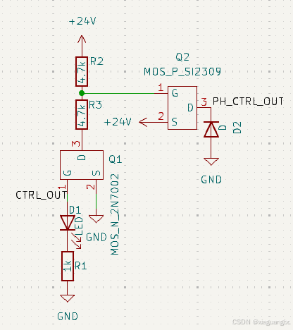

## 简介

下图就是 PMOS 和 NMOS  的简单使用方法。D1 是指示灯，NMOS 的 G 连接单片机 IO，PMOS 的 D 输出 24V 电压，D2 是消耗继电器反电动势

PMOS 和 NMOS 不一样，在远超单片机电压下控制 PMOS 必须依靠一个 NMOS，不能用单片机的 IO 直接代替这里的 NMOS 作控制，不然高压会直接击穿单片机

可以这么理解

PMOS 用于发送正电压，NMOS 用于接收正电压

从电源正极向负极走，PMOS 电路的负载应在 PMOS 的后面，NMOS 电路的负载应在 NMOS 的前面

PMOS 主电流路径是 S 流向 D，NMOS 主电流路径是 D 流向 S

PMOS 和 NMOS 的 D 都接负载，但 PMOS 的 S 接电源正极，而 NMOS 的 S 接电源的负极

## 参数说明

Vds 就是常说的耐压，就是电源的电压不能超过 Vds

PMOS SI2309 和 NMOS 2N7002 的 Vgs 耐压都是正负 20V，也就是 G 极的绝缘层耐压只有 20V，需要注意 G 极不能超 Vgs （max/最大/击穿）电压

Vgs 导通电压一般不会太高，一般接近完全导通时的电压的绝对值是 4V 左右，3.3V 也行

温度会影响导通后的阻值，一般 125 摄氏度时的其阻值会达到 25 摄氏度下的三倍左右，电流越大温升也越厉害

## 控制电路
- NMOS

  Vgs 导通电压是正的，看 G 比 S 电压高多少会导通。S 接了电源地，也可以说是看 G 比电源地的电压 高 多少会导通

- PMOS

  Vgs 导通电压是负的，看 G 比 S 电压低多少会导通。S 接了电源正，也可以说是看 G 比电源正的电压 低 多少会导通

  就拿上面那个图来说

  如果 NMOS 不开启，这时相当于 PMOS 的 G 串联 R2 后接了 24V，由于 S 也接了 24V，G - S = 0V，所以 PMOS 也不开启

  如果 NMOS 开启，R2 R3 各分压一半，也就是 12V，所以 G 对地也是 12V，G - S = -12V，PMOS 也开启了，并且因为电阻分压，Vgs 也没有超过最大值，不会击穿
